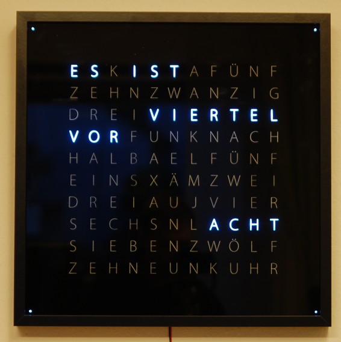

# WordClock

Very basic but functional code (only german)  
It is based on a "IKEA Ribba" Frame with 520x520 mm and 113 WS2812 LEDs.

# WiFi web configuration portal
- Initial WiFi Name is "WordClock ConfigAP" without Password  
- The config website can be found under [192.168.4.1](192.168.4.1)

# Over The Air Update
The OTA page can be found here: <ip_of_clock>/update

